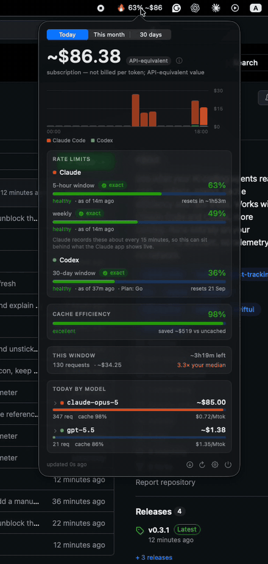

# burn-o-meter (One meter for every agent in both GUI and CLI)

**See what your AI coding agents really cost.** Tokens, spend, cache efficiency
and rate limits — all read from files already on your machine. No account, no
telemetry, nothing sent anywhere.

> **Status: alpha (v0.3.3).** The CLI and the macOS menu bar app both work end to
> end for Claude Code and Codex. Tested on macOS 14+; the CLI is portable but
> Windows and Linux are not yet verified.

`burn-o-meter` reads the logs your agents already write to disk and tells you what
they actually cost — tokens, dollars, cache efficiency, and how much of your rate
limit is gone — in your menu bar and on the command line.

```
$ burn-o-meter models --since 30d
Usage by model
  model             reqs      cost   share   cache hit   eff $/Mtok
  claude-opus-5      787  ~$129.33   56.4%       96.9%         1.01
  claude-opus-4-8    361   ~$63.27   36.7%       98.9%         0.71
  claude-fable-5      57   ~$11.88    6.9%       97.7%         2.03
                          ---------
  subtotal                ~$204.48   subscription — not billed per token
```

## What it looks like

<p align="center">
  
</p>

The menu bar shows the number that matters at a glance; the popover has the rest.
Every figure carries its provenance — `~` means API-equivalent rather than billed,
`exact` means the provider reported it, and a model with no known price shows `—`
rather than `$0.00`.

The CLI reports the same numbers:

```console
$ burn-o-meter today
Today
┏━━━━━━━━━━━━━━━┳━━━━━━┳━━━━━━━━━┳━━━━━━━┳━━━━━━━━┳━━━━━━━━━━━┳━━━━━━━━━━━━┓
┃ model         ┃ reqs ┃    cost ┃ share ┃ tokens ┃ cache hit ┃ eff $/Mtok ┃
┡━━━━━━━━━━━━━━━╇━━━━━━╇━━━━━━━━━╇━━━━━━━╇━━━━━━━━╇━━━━━━━━━━━╇━━━━━━━━━━━━┩
│ claude-opus-5 │  286 │ ~$68.88 │ 99.7% │  90.9M │     98.1% │       0.76 │
│ gpt-5.5       │    3 │  ~$0.17 │  0.3% │  56.4K │     55.9% │       3.09 │
└───────────────┴──────┴─────────┴───────┴────────┴───────────┴────────────┘

  ~$69.06 across 289 requests   subscription — not billed per token; this is
  API-equivalent value

  current 5h window  ~$18.14 over 69 requests · ~4h10m left
  1.8x your median window. Claude publishes no token limit for subscription
  plans and stores no quota locally, so this compares against your own history
  rather than inventing a percentage.

  codex primary  5% used of a 30-day window · plan go   exact (reported by Codex itself)
```

```console
$ burn-o-meter blocks
5-hour usage windows
┏━━━━━━━━━━━━━━┳━━━━━━┳━━━━━━━━┳━━━━━━━━━┳━━━━━━━━━━━━━━━━┳━━━━━━━━┓
┃ window start ┃ reqs ┃ tokens ┃    cost ┃ vs your median ┃ state  ┃
┡━━━━━━━━━━━━━━╇━━━━━━╇━━━━━━━━╇━━━━━━━━━╇━━━━━━━━━━━━━━━━╇━━━━━━━━┩
│ 08-21 00:02  │  248 │  40.0M │ ~$33.92 │           3.3x │ closed │
│ 08-21 13:49  │   84 │  28.2M │ ~$28.04 │           2.7x │ closed │
│ 08-21 18:58  │   61 │  31.6M │ ~$19.85 │           1.9x │ closed │
└──────────────┴──────┴────────┴─────────┴────────────────┴────────┘
```

## Why another usage tracker

**One meter for every agent.** Nobody runs just one — Claude Code here, Codex
there. Each vendor's dashboard sees only itself, so nothing answers "what is all of
this costing me?" burn-o-meter reads them into one ledger.

**A menu bar app and a CLI, showing the same numbers.** Glance at the menu bar for
spend and rate limits with their reset times, or run `burn-o-meter today`, `models`,
`daily` in a terminal and pipe `--json` anywhere.

**It measures the tool, not just the model.** Two tools running the same model bill
differently, because they cache and resend context differently.

**And it tells you the truth about what you owe.** Claude Max and ChatGPT plans
aren't billed per token, so "you spent $204" would be a lie. Subscription figures
are labelled API-equivalent. A model we have no price for shows `—`, never `$0.00`.

**The number that actually matters:** at a 97% cache-hit rate, list prices tell you
very little. Opus 5 lists at $5/Mtok input and lands near **$1/Mtok** all-in, so
`models` reports that effective rate per model alongside the list one.

Everything stays on your machine. No account, no telemetry, and no network traffic
unless you ask for it.

## Install

Requires **Python 3.11+** (macOS 14+ for the menu bar app). Not on PyPI yet.

```bash
# Homebrew
brew tap devopsinside/burn-o-meter https://github.com/devopsinside/burn-o-meter
brew install devopsinside/burn-o-meter/burn-o-meter

# or pipx / uv
pipx install git+https://github.com/devopsinside/burn-o-meter
uv tool install git+https://github.com/devopsinside/burn-o-meter
```

Then:

```bash
burn-o-meter scan      # read your logs (first run takes ~150ms)
burn-o-meter today     # what today cost, and where your limits stand
```

### The menu bar app

**Those commands install the CLI only** — there is no `.app` yet, and nothing will
appear in your menu bar until you build one. It is a separate, optional step,
because an unsigned app cannot be distributed through Homebrew without every user
meeting a Gatekeeper warning.

```bash
git clone https://github.com/devopsinside/burn-o-meter
cd burn-o-meter
macos/make-app.sh --install             # builds, installs to /Applications
open /Applications/burn-o-meter.app     # the icon appears now

# so it comes back by itself after a reboot
/Applications/burn-o-meter.app/Contents/MacOS/burn-o-meter --enable-login-item
```

**That last line matters.** macOS will not register a login item for an app running
from a build directory, which is why `--install` puts it in `/Applications` first.
Skip it and the app works until your next reboot, after which the icon is gone and
Spotlight is the only way back. The gear menu's **Launch at Login** does the same
thing.

macOS trusts an app you compiled yourself; a downloaded one is blocked until Apple
has been paid for a certificate — which is the whole reason this is a build step
rather than a download.

No developer tools on the machine, or want to try it without installing anything?
See [docs/install.md](docs/install.md) — it also covers Homebrew tap trust and
uninstalling.

## Usage

```bash
burn-o-meter today                # today's cost, current window, rate limits
burn-o-meter models --since 30d   # per-model cost, cache hit rate, $/Mtok
burn-o-meter daily --since 14d    # per-day
burn-o-meter projects             # per-project
burn-o-meter blocks               # rolling 5-hour windows
burn-o-meter doctor               # what was detected, stored, and where prices came from
```

> **Tip:** `burnometer` is installed as an alias for every command, so
> `burnometer today` works too if you would rather skip the hyphens.

`--json` works on any report and carries the same rules: subtotals keyed by cost
basis with no fused total, `price_source` on every row, unpriced models listed
explicitly.

Everything is optional to configure. If you **pay per token against an API key**,
set `claude_code = "api"` in `~/.burn-o-meter/config.toml` so your spend is not
labelled API-equivalent — see [docs/configuration.md](docs/configuration.md) for
that, project-path privacy, custom rates and retention.

## Supported agents

| Agent | Tokens | Cost | Rate limits | Read from |
|---|:-:|:-:|:-:|---|
| **Claude Code** | ✅ | ✅ | via the row below | `~/.claude/projects/*/*.jsonl` |
| **Codex CLI** | ✅ | ✅ | **exact** — with reset time | `~/.codex/sessions/**/rollout-*.jsonl` |
| Claude plan usage | — | — | **exact** — 5-hour and weekly | `~/Library/Application Support/Claude/plan-usage-history.json` |

Claude Code's own transcripts carry no quota, so the 5-hour and weekly figures
come from the Claude desktop app's records — which cover the whole account,
since the limit is shared with Claude chat. They are Anthropic's own
percentages, not something we derived — but the desktop app records them only
about every 15 minutes, so a reading can sit behind what that app shows live.
Each carries its age and the UI says so rather than presenting an old number as
current. The **reset countdown** is derived from the series and marked `~`; none
is claimed for the weekly cap, where the evidence does not support one.

Agent data can be relocated (`CLAUDE_CONFIG_DIR`, `CODEX_HOME`), and Claude Code
writes to `~/.claude` or `~/.config/claude` depending on install. Both are
checked; `burn-o-meter doctor` names the variable when a location is missing.

**On the roadmap, in order:** OpenCode, then Kimi Code, then Copilot CLI, then
Amp, Droid, Goose and Kilo. OpenCode comes first because one adapter reaches
DeepSeek, Kimi, GLM, Qwen, MiniMax *and* local models — it is also the only route
to local inference, since **Ollama does not persist token usage at all**
(`eval_count` is returned per request and discarded). Local models are therefore
only measurable through a harness that records them.

Each adapter is verified against real output from the tool before it ships, never
from documentation alone — Codex's per-turn accounting trap looked entirely
reasonable on paper. The contract is thin on purpose:
[docs/adding-an-agent.md](docs/adding-an-agent.md).

## Privacy and security

This tool reads conversation transcripts. It is built as though that matters.

- **Your prompts and completions are never read.** Adapters extract through a
  strict allowlist of numeric and metadata fields; message content is unreachable
  by construction. CI greps the entire output database, JSON and logs for planted
  canary strings on every commit.
- **Credentials are never opened.** `~/.codex/auth.json` lives inside a directory
  we scan. A filename deny-list, narrow globs, and symlink containment each
  independently prevent it.
- **No network unless you ask.** No telemetry, no analytics, no crash reporting,
  and nothing on a timer or at launch. Two requests exist in the whole codebase and
  both are manual: `burn-o-meter pricing refresh`, and **Check for Updates…** in the
  menu. Neither sends anything about you. The engine's test suite blocks sockets, so
  a green build is itself evidence.
- **No credentials, ever.** We do not read your Claude or OpenAI login, and we
  never will — Anthropic's terms prohibit automated access to their service using
  subscription credentials, and the cost of breaking that would land on your
  account, not ours.
- **Nothing leaves your machine.** There is no server. There is no account.

Run `burn-o-meter doctor --security` to audit these rather than trust them. Full
threat model: [SECURITY.md](SECURITY.md).

## More

- [FAQ and troubleshooting](docs/faq.md) — including what the desktop apps do and do not report
- [Installing in detail](docs/install.md) · [Configuration](docs/configuration.md)
- [Adding an agent](docs/adding-an-agent.md) · [Roadmap](ROADMAP.md) · [Contributing](CONTRIBUTING.md)
- [Security](SECURITY.md) — threat model, guarantees, and how to report privately

## Development

```bash
python3 -m venv .venv
.venv/bin/pip install -e ".[dev]"
.venv/bin/pytest                  # the full suite, under a second
.venv/bin/ruff check src tests

swift build --package-path macos/burn-o-meter -c release
/Applications/burn-o-meter.app/Contents/MacOS/burn-o-meter --dump   # UI state as JSON
```

The `--dump` output must agree with `burn-o-meter today --json`; the app renders
numbers but never computes them, so a disagreement means something is wrong.

## Roadmap

Built one at a time, each verified against real output before it ships.
**Next up:** other providers through the agents we already support, then
OpenCode — which reaches DeepSeek, Kimi, GLM, Qwen, MiniMax and local models in
a single adapter.

Full list, including what will *not* be built and why: **[ROADMAP.md](ROADMAP.md)**


## License

MIT — see [LICENSE](LICENSE). Bundled model pricing derives from
[models.dev](https://github.com/anomalyco/models.dev) (MIT); see [NOTICE](NOTICE).

No code is derived from other usage trackers. All log-format handling was written
from first-hand inspection of what Claude Code and the Codex CLI produce on disk.
